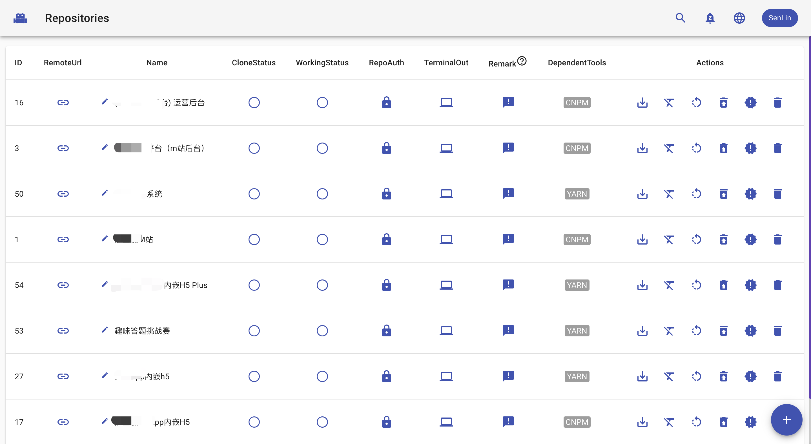

<div align=center>

</div>
<div align=center>
<a href="./README.zh-Hans.md">中文说明</a>
</div>
<div align=center>


</div>



# MareWood
>MareWood is a lightweight front-end deployment tool that is developed using GOLANG, GIN, GORM, JWT, WEBSOCKET, SQLITE, REACT, and MATERIAL-UI. Unlike Jenkins, which is large and comprehensive, MareWood is simple and focuses specifically on front-end. You can flexibly configure various deployment environments. If you wish, online publishing can be as simple as clicking a button, and of course, you can also configure WEBHOOK, so that submitting GIT code will automatically release.


# What is MareWood doing?
MareWood is a front-end deployment tool that can help you clone your front-end repository and install dependencies using the tools you choose. It allows you to package multiple environments in the same repository by using different task commands and different branches. The generated front-end resources will be placed in the "resources\webs" directory, and can be accessed easily by corresponding task IDs. MareWood is designed to be easy to use, flexible and super easy to access.

# Usage
## To use MareWood, users can:

1. Fill in the repository address
2. Create multiple tasks associated with the repository
3. Click the package button, wait for the process to complete and then access the resources.
> Once a task is created, users can switch branches and package them at any time.

## Docker installation
The MareWood container directory /marewood/resources contains the program database, all cloned repositories, and packaged front-end resources. It is recommended to map it to a directory on the host for data persistence.
```
docker run -d --name marewood -p 8088:8088 -v ~/marewood:/marewood/resources ghcr.io/xusenlin/marewood:0.4
```
In this way, you can access MareWood through port 8088, and access the packaged repository resources through localhost:8088/webs/taskId. It is recommended to use nginx to provide a static file server for ~/marewood/webs, so that you can use https to access the front-end content.
```
docker run -d --name marewood -p 8088:8088 -v ~/marewood:/marewood/resources -e MW_URL=https://your-url.com ghcr.io/xusenlin/marewood:0.4 
```
In this way, MareWood provides quick access to https://your-url.com/taskId


## Manual installation
1. Install git, node, npm on the server, it is recommended to install cnpm and yarn for options.
2. Configure the port number and front-end resource domain for MareWood startup through the MW_PORT and MW_URL environment variables.
3. Enter the public directory to install front-end dependencies and package them to generate the build folder.
4. Compile MareWood and run it in the background.

Other: MareWood provides http access, it is recommended to use nginx to provide https static file server (nginx points to resources\webs, configure your OtherAddressUrl field, can be left blank) in this way you can flexibly choose http or https to access the packaged front-end project.


How can a React or Vue project configure multiple build commands? Please refer to http://xusenlin.com/article?key=iQBftC


# Roles

Currently, the roles are divided into: Super Administrator, Administrator, Developer, and Project Journalist. The permissions are as follows:

- Project Journalist - can only view all content and access the packaged front-end project
- Developer - has the permissions to create repositories, categories, tasks, pull code, switch branches, run builds, delete dependencies, and trim branches
- Administrator - can delete repositories, categories, and tasks
- Super Administrator - can manage users (promote and demote roles, delete users)
- 
Note: Higher-level roles have all the permissions of lower-level roles. Users are registered as Project Journalists by default. If the registered name is Admin, it will automatically become a Super Administrator. Registered names cannot be duplicated.


# Update log
### Unpublished (current code 2022.11.07)
* Add one-click download of the packaged compressed file (visit you-url/run_task_and_pack?id=3 to use the latest code to package the corresponding task and generate a compressed package for download)
* Add a task default branch modification to main

### v0.40
(This version upgrade requires the jobs table to be modified to tasks, the repository table's job_status field to be modified to task_status, and the category table's job_quantity field to be modified to task_quantity)

* Re-optimized the Logo, it looks smarter than before :) (2021-01-17)
* Added online number display (2021-01-05)
* Added internationalization support (2021-01-05)
* Added the ability to quickly locate the corresponding repository for a task (2020-12-31)
* webhook support for post or get requests (2020-12-30)
* Partially refactored the front-end task code (2020-12-30)
* Optimized the search bar and added category searchability (2020-12-30)
* Added websocket notification record (2020-12-30)

### v0.30
* @wenbiyou added the search function for tasks and repositories (2020-12-07)
* Added a websocket retry mechanism
* @wojiaolingdu111 added the repository rebuilding function
* Added websocket broadcasting, so that the status of each repository and task is in real-time synchronization with all people.
* Optimized the interface request loading animation to prohibit page operation.
* Added the ability to view the user's code submission record.

# License

MIT
