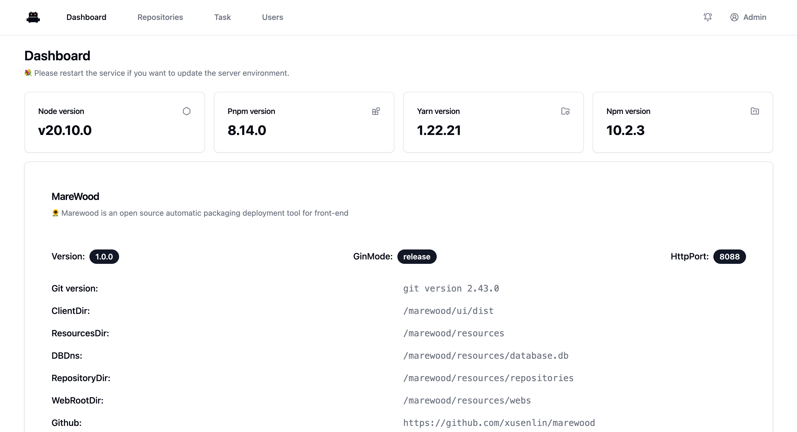
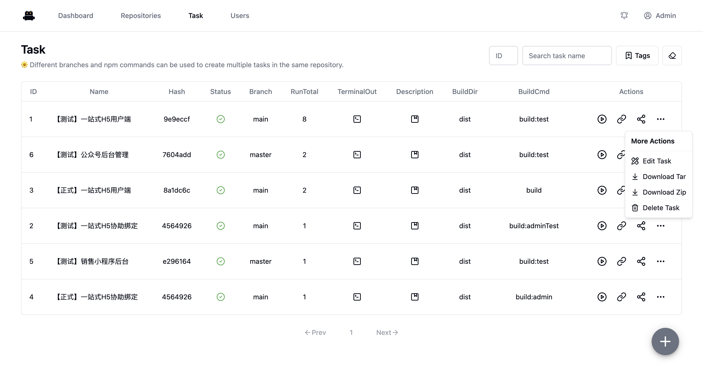
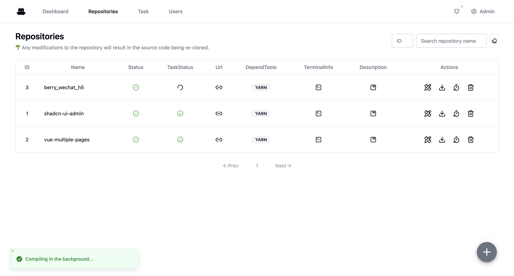

# MareWood
marewood is an open source automatic packaging deployment tool for front-end

# What is MareWood doing?
marewood will help you clone the frontend Git repository. Once you associate a repository with a packaging task, you can choose the branch and command for packaging. After a successful packaging, you can access it through an alias.

# Usage

If the registered username is Admin, it will automatically become a super administrator, and usernames cannot be repeated.

## node16
```shell
docker run -d --name marewood -p 8088:8088 -v ~/docker/marewood:/marewood/resources ghcr.io/xusenlin/marewood:1.0.0-node16
```
## node18
```shell
docker run -d --name marewood -p 8088:8088 -v ~/docker/marewood:/marewood/resources ghcr.io/xusenlin/marewood:1.0.0-node18
```
## node20
```shell
docker run -d --name marewood -p 8088:8088 -v ~/docker/marewood:/marewood/resources ghcr.io/xusenlin/marewood:1.0.0-node20
```

# Screenshot




# Roles

Currently, the roles are divided into: Super Administrator, Administrator, Developer, and Project Journalist. The permissions are as follows:

- Project Journalist - can only view all content and access the packaged front-end project
- Developer - has the permissions to create repositories, categories, tasks, pull code, switch branches, run builds, delete dependencies, and trim branches
- Administrator - can delete repositories, categories, and tasks
- Super Administrator - can manage users (promote and demote roles, delete users)
Note: Higher-level roles have all the permissions of lower-level roles. Users are registered as Project Journalists by default. If the registered name is Admin, it will automatically become a Super Administrator. Registered names cannot be duplicated.

  
# Note

## docker for mac
If you want to use pnpm to install dependencies in a Docker container on Mac, you need to modify the Docker file mounting method to osxfs.
issues: https://github.com/docker/for-mac/issues/6787
🙁🙁
The thing is that osxfs has bad performance compared to grpc, and even worse compared to virtiofs...

# License

MIT © MareWood
