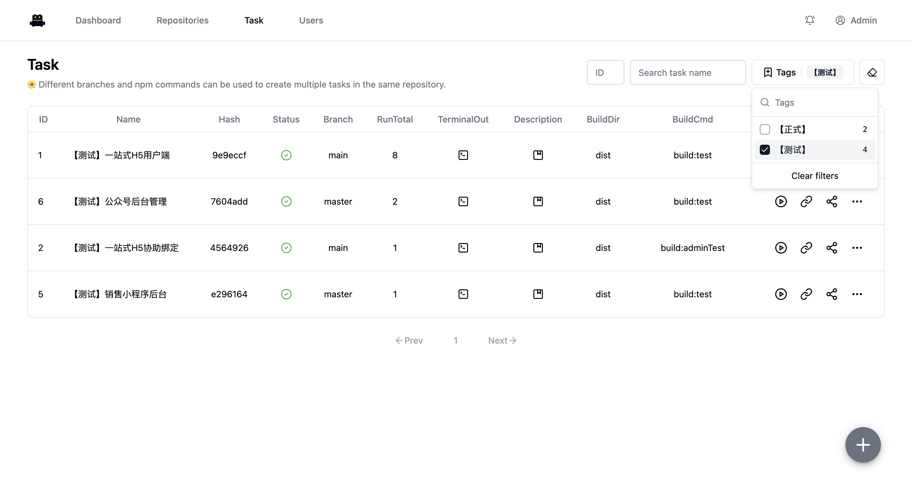
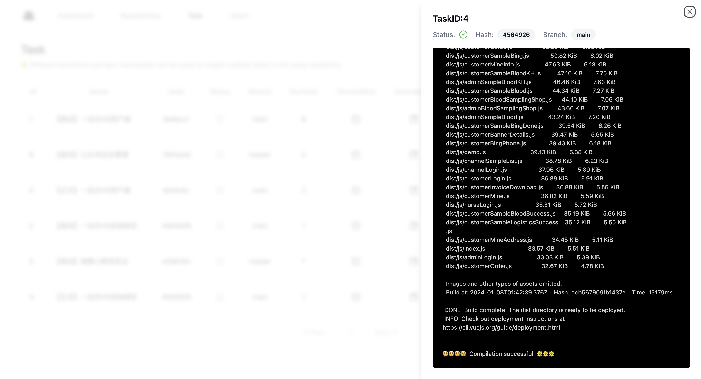

# MareWood
> [中文文档](./README_CN.md)

marewood is an open source automatic packaging deployment tool for front-end

# What is MareWood doing?
marewood will help you clone the frontend Git repository. Once you associate a repository with a packaging task, you can choose the branch and command for packaging. After a successful packaging, you can access it through an alias.

# Usage
- If the registered username is Admin, it will automatically become a super administrator, and usernames cannot be repeated.
- Configure the front-end project to automatically select different API request addresses using different packaging commands, in order to meet the packaging requirements of various environments.
- If you need to switch the Node.js version, please stop the Marewood container and run another version of the container using the same mounted directory.
- The mounted "resources" directory contains database files, cloned Git repositories, log files,and packaged static files (in the "web" directory). Nginx is used to serve the static files and is configured to point to the "web" directory. This setup allows for accessing the packaged projects freely using URLs.

## node16
```shell
docker run -d --name marewood -p 8088:8088 -v ~/docker/marewood:/marewood/resources ghcr.io/xusenlin/marewood:1.0.3-node16
```
## node18
```shell
docker run -d --name marewood -p 8088:8088 -v ~/docker/marewood:/marewood/resources ghcr.io/xusenlin/marewood:1.0.3-node18
```
## node20
```shell
docker run -d --name marewood -p 8088:8088 -v ~/docker/marewood:/marewood/resources ghcr.io/xusenlin/marewood:1.0.3-node20
```
## node22
```shell
docker run -d --name marewood -p 8088:8088 -v ~/docker/marewood:/marewood/resources ghcr.io/xusenlin/marewood:1.0.3-node22
```
# Screenshot
### Dashboard

### Repo

### Task

#### Task Tag

#### Task Info


# Roles

Currently, the roles are divided into: Super Administrator, Administrator, Developer, and Project Journalist. The permissions are as follows:

- Project Journalist - can only view all content and access the packaged front-end project
- Developer - has the permissions to create repositories, categories, tasks, pull code, switch branches, run builds, delete dependencies, and trim branches
- Administrator - can delete repositories, categories, and tasks
- Super Administrator - can manage users (promote and demote roles, delete users)
Note: Higher-level roles have all the permissions of lower-level roles. Users are registered as Project Journalists by default. If the registered name is Admin, it will automatically become a Super Administrator. Registered names cannot be duplicated.

  
# Note
## Repo
If your git repository is not public, you need to provide your Git account and password when creating the repository to obtain cloning permission.
## task
This task runs every time using git pull to fetch the latest code, and displays the hash of the current git commit in the task field column, so you can confirm if it is the latest submission.
## docker for mac
If you want to use pnpm to install dependencies in a Docker container on Mac, you need to modify the Docker file mounting method to osxfs.
issues: https://github.com/docker/for-mac/issues/6787
🙁🙁
The thing is that osxfs has bad performance compared to grpc, and even worse compared to virtiofs...

# License

MIT © MareWood
