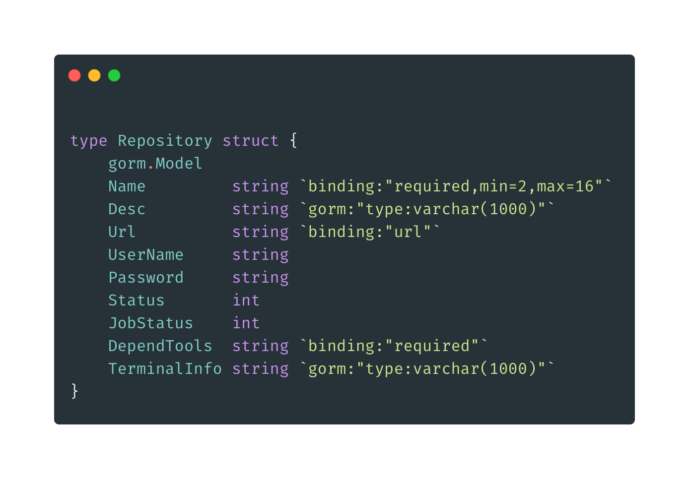
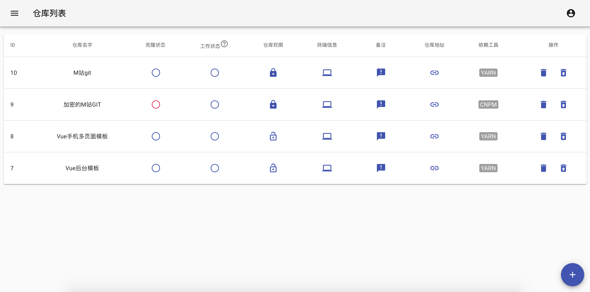
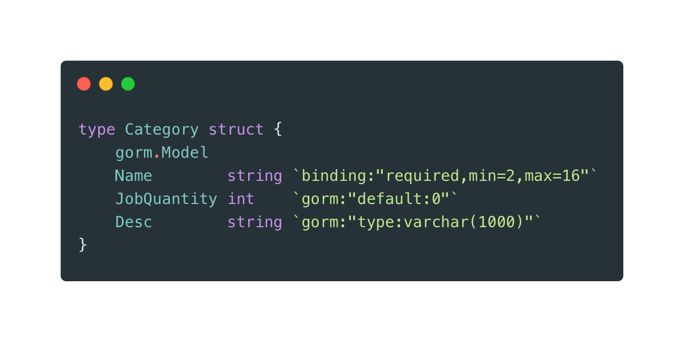
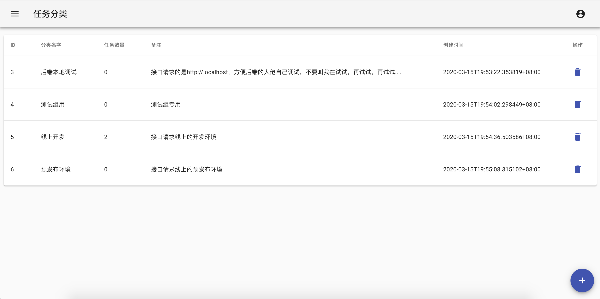
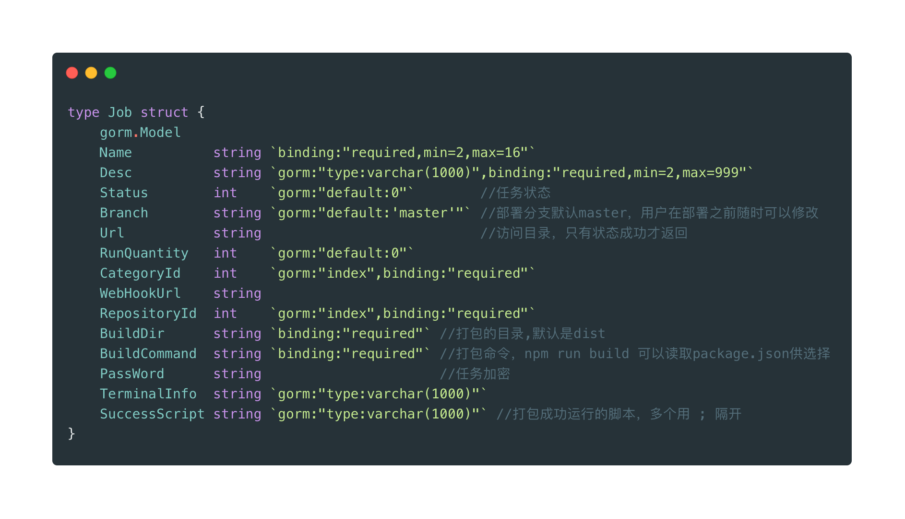
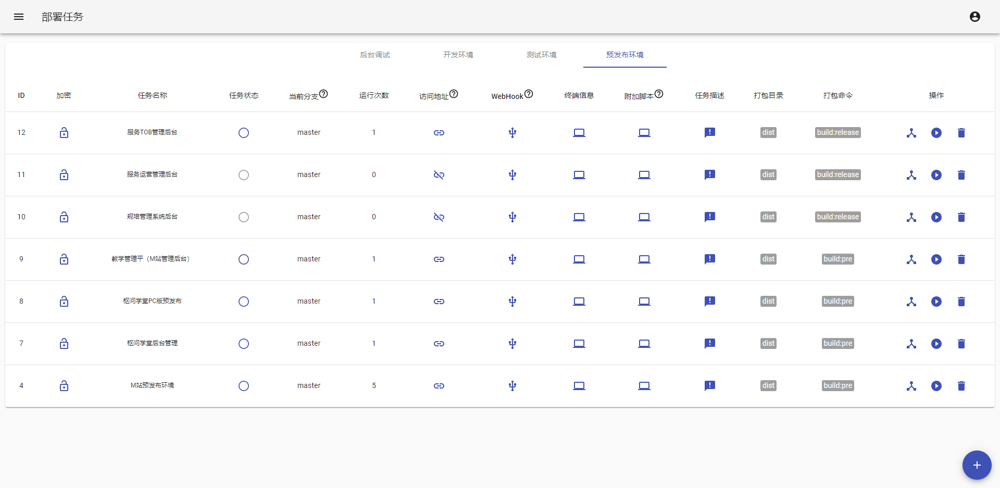

# MareWood
>MareWood 是一个轻量级的前端部署工具，使用了 GOLANG、GIN、GORM、SQLITE、REACE、MATERIAL-UI 开发，
不同于 Jenkins 的大而全，它很简单且只针对前端，你可以很灵活的配置各种部署环境。
如果你愿意，线上发布也可以是点击一下按钮这么简单的事情,当然也可以配置 WEBHOOK，提交 GIT 代码既自动发布。

## 使用
MareWood 编译生成一个二进制文件，你只需要把这个二进制文件和客户端（前端打包的文件，在public/build下）放在服务器上启动即可，不需要在安装额外的软。

# MareWood 在做什么
MareWood 可以帮你克隆前端仓库并使用你选择的工具安装依赖，并能在同一个仓库下通过不同的任务不同的打包命令打包出多个环境下的前端资源并提供快捷访问。目前麻烦的是没有使用队列，因此同一时间你只能对一个仓库执行打包操作，仓库也会被锁定。当然，同时对不同的仓库执行打包则没有任何问题，这个在一个中小团队中使用基本没什么影响。

那么，一个 React 或者 Vue 项目如何配置多个打包命令呢？
请移步http://xusenlin.com/article?path=%2f%e5%89%8d%e7%ab%af%e5%bc%80%e5%8f%91%2fREACT%e5%92%8cVUE%e7%9a%84%e5%a4%9a%e5%a5%97%e6%89%93%e5%8c%85%e7%8e%af%e5%a2%83.md

如果不明白也可以参考实际的项目

- https://github.com/xusenlin/VueMultiplePages.git
- https://github.com/xusenlin/VueElementUiAdmin.git

# PREVIEW

### Repository

### Category

### Job

## 接下来？？
如果你喜欢这个项目，也可以参与进来，目前没有那么多时间，因此只完成了核心的功能，甚至连用户和权限模块都没有，当然，单元测试可能也没有，也许吧。

## 番外

MareWood 翻译过来是 玛瑞·伍德 看上去像是一个人的名字，其实它是代表两个人，一个咒语。

## License

MIT © Richard McRichface
