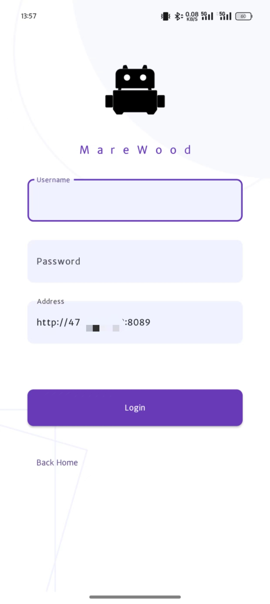
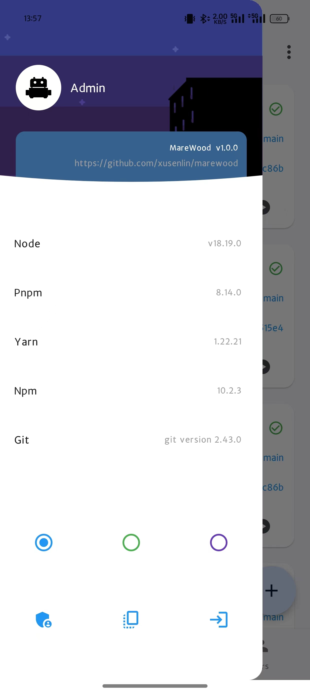
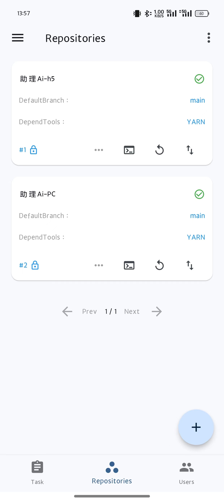
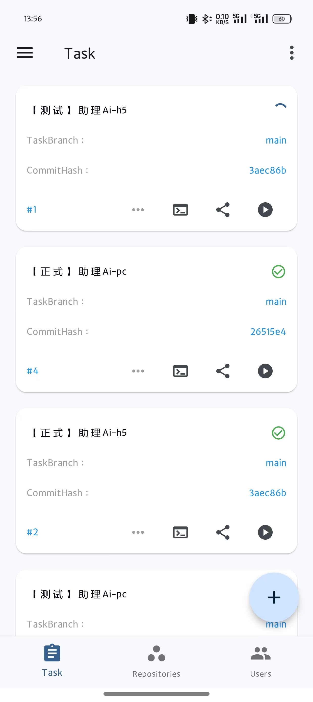
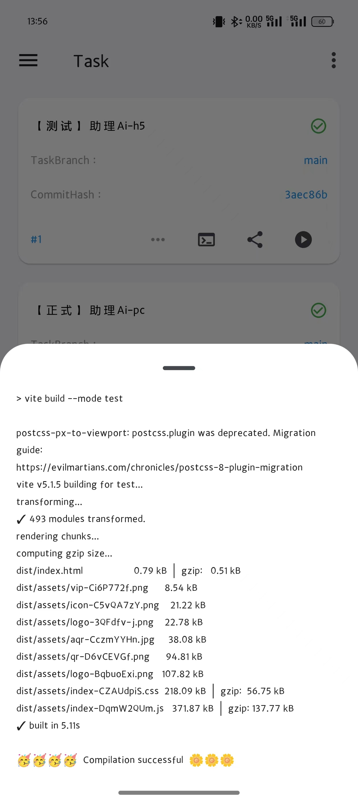

# MareWood
marewood 是一个针对前端的自动化打包部署工具。

# marewood在做什么？
marewood 能帮你克隆前端 Git 仓库。克隆成功之后您可以创建多个打包任务并关联这个git仓库，然后可以选择要打包的分支和命令。打包成功后，您可以通过别名访问它，也可以下载zip和tar格式的的打包资源。

# 使用提示
- 如果你注册的用户名为 Admin, 它将自动成为超级管理员，注册用户名不能重复。
- 配置前端项目的 package.json 的 scripts，通过不同的打包命令自动选择不同的API请求地址，以满足各种环境的打包需求。
- 如果你需要切换 Node.js 版本，请停止 Marewood 容器，并使用相同的挂载目录运行另一个版本的容器，但是可能需要重新安装仓库依赖。所以建议你可以使用不同的容器挂载不同的目录来同时使用多个版本。
- 挂载的 resources 目录中包含了 sqlite 数据库文件、克隆的Git仓库、日志文件和打包好的静态文件（在“web”目录中）。可以配置 Nginx 指向任务对应的静态文件，这样可以通过URL自由访问已打包好的项目。
- 因为 resources 里面包含了克隆的前端Git仓库，当仓库出现依赖和git相关的错误时，你可以手动修复这个仓库。
- 对于一些特殊的关键任务，你可以设置为私有项目，这样其他开发者就无法访问和编辑，只能由你上线部署。

## node16
```shell
docker run -d --name marewood -p 8088:8088 -v ~/docker/marewood:/marewood/resources ghcr.io/xusenlin/marewood:1.0.3-node16
```
## node18
```shell
docker run -d --name marewood -p 8088:8088 -v ~/docker/marewood:/marewood/resources ghcr.io/xusenlin/marewood:1.0.3-node18
```
## node20
```shell
docker run -d --name marewood -p 8088:8088 -v ~/docker/marewood:/marewood/resources ghcr.io/xusenlin/marewood:1.0.3-node20
```
## node22
```shell
docker run -d --name marewood -p 8088:8088 -v ~/docker/marewood:/marewood/resources ghcr.io/xusenlin/marewood:1.0.3-node22
```
# 截图
### Dashboard

### Repo

### Task

#### Task Tag

#### Task Info


# 角色

当前角色被分为：超级管理员、管理员、开发者和项目记者。权限如下：

- 项目记者：只能查看所有内容并访问打包的前端项目
- 开发人员：具有创建存储库、任务、拉取代码、切换分支、运行构建、删除依赖项和修剪分支的权限
- 管理员： 能够删除存储库、任务
- 超级管理员：可以管理用户（提升和降低角色，删除用户）
  注意：较高级别的角色具有较低级别角色的所有权限。用户默认注册为项目记者。如果注册用户名为Admin，则将自动成为超级管理员。注册用户名不得重复。
  
# 笔记
## Repo
如果你的git仓库不是公开的，你需要在创建仓库时提供你的git账号和密码来获取克隆权限。
## task
任务运行时每次使用git pull获取最新的代码，并在任务字段列中显示当前git提交哈希值，所以你可以通过hash确认是否是最新的提交。
## docker for mac
如果你想使用pnpm来安装前端依赖，你需要修改Docker文件挂载方式为osxfs。因为在Docker挂载中使用pnpm会有问题：https://github.com/docker/for-mac/issues/6787
🙁🙁


# android and ios app
[App](https://github.com/xusenlin/marewoodClient)
### Currently under development, please stay tuned.

<div style="display: flex; justify-content: space-between;">
  
  
</div>
<div style="display: flex; justify-content: space-between;">
  
  
</div>
<div style="display: flex; justify-content: flex-start;">
  
</div>

# License

MIT © MareWood
