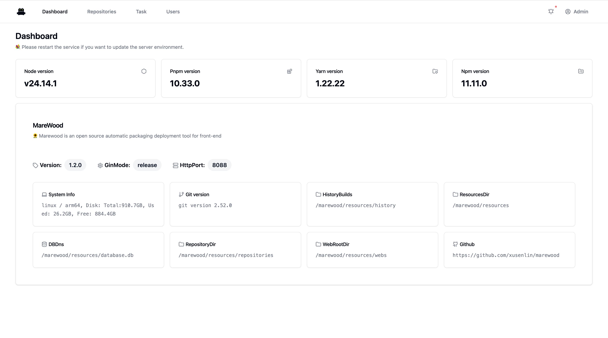
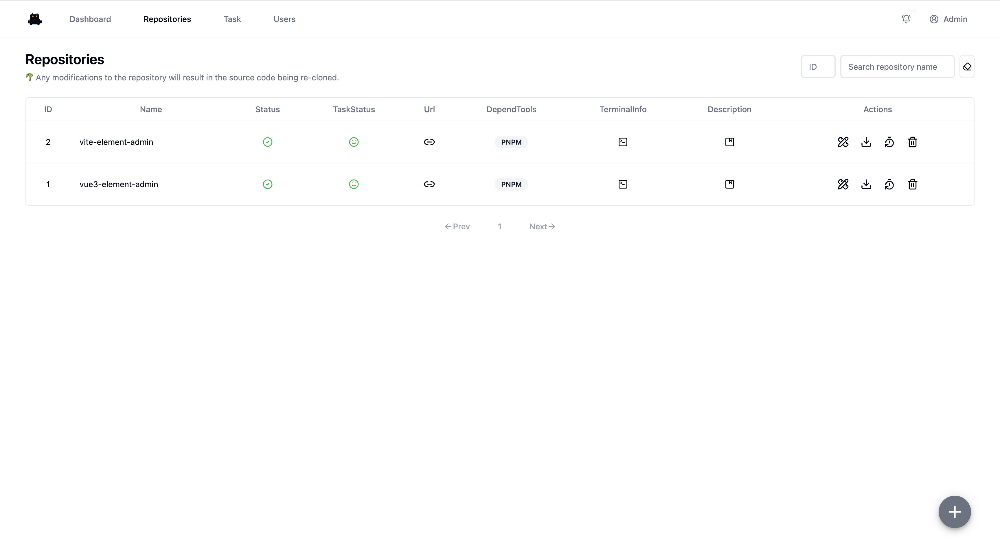
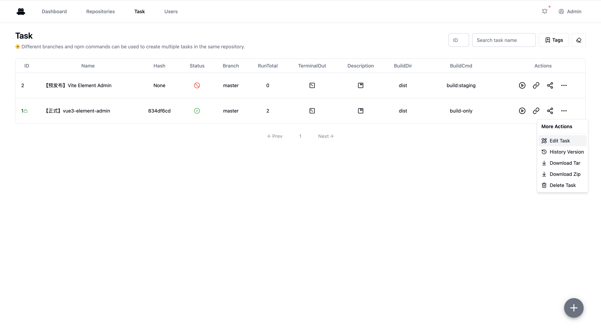
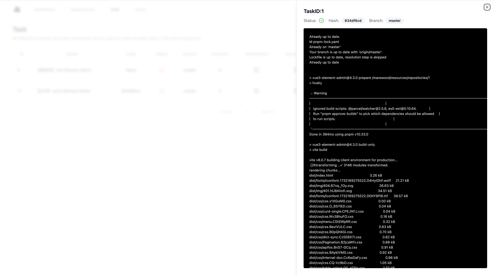
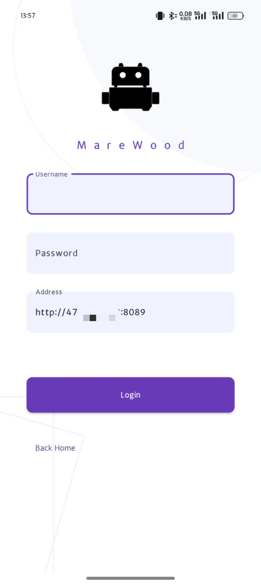
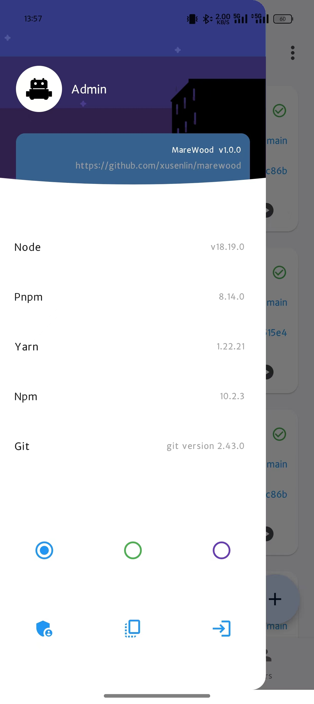
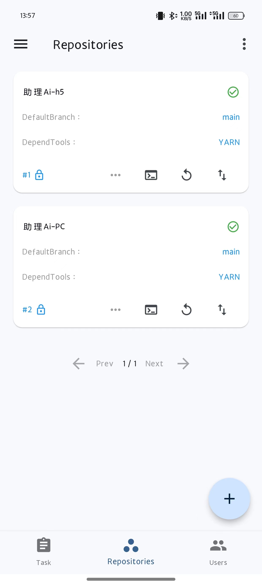
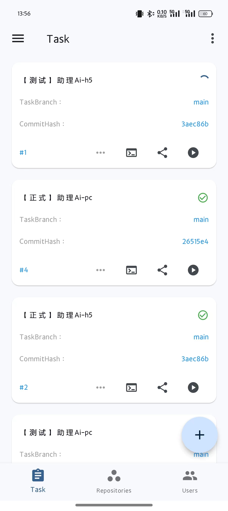
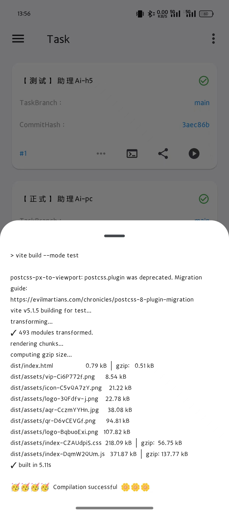

# MareWood
marewood 是一个针对前端的自动化打包部署工具。

# marewood在做什么？
marewood 能帮你克隆前端 Git 仓库。克隆成功之后您可以创建多个打包任务并关联这个git仓库，然后可以选择要打包的分支和命令。打包成功后，您可以通过别名访问它，也可以下载zip和tar格式的的打包资源。

# 使用提示
- 如果你注册的用户名为 Admin, 它将自动成为超级管理员，注册用户名不能重复。
- 配置前端项目的 package.json 的 scripts，通过不同的打包命令自动选择不同的API请求地址，以满足各种环境的打包需求。
- 如果你需要切换 Node.js 版本，请停止 Marewood 容器，并运行另一个版本的容器。每个 Node 版本使用独立的命名卷（例如 node22 使用 `marewood-data-22`），以避免兼容性问题。
- 命名卷中的 resources 目录中包含了 sqlite 数据库文件、克隆的Git仓库、日志文件和打包好的静态文件（在“web”目录中）。可以配置 Nginx 指向任务对应的静态文件，这样可以通过URL自由访问已打包好的项目。
- 因为 resources 里面包含了克隆的前端Git仓库，当仓库出现依赖和git相关的错误时，你可以手动修复这个仓库。
- 对于一些特殊的关键任务，你可以设置为私有项目，这样其他开发者就无法访问和编辑，只能由你上线部署。

## node16
```shell
docker run -d --name marewood -p 8088:8088 -v marewood-data-16:/marewood/resources ghcr.io/xusenlin/marewood:1.2-node16
```
## node18
```shell
docker run -d --name marewood -p 8088:8088 -v marewood-data-18:/marewood/resources ghcr.io/xusenlin/marewood:1.2-node18
```
## node20
```shell
docker run -d --name marewood -p 8088:8088 -v marewood-data-20:/marewood/resources ghcr.io/xusenlin/marewood:1.2-node20
```
## node22
```shell
docker run -d --name marewood -p 8088:8088 -v marewood-data-22:/marewood/resources ghcr.io/xusenlin/marewood:1.2-node22
```
## node24
```shell
docker run -d --name marewood -p 8088:8088 -v marewood-data-24:/marewood/resources ghcr.io/xusenlin/marewood:1.2-node24
```

>>>镜像基于 alpine 多阶段构建，只包含必要的运行依赖，不会过多占用你的磁盘。为了使用 alpine,放弃了带 cgo 的 sqlite 包，转而使用纯 go 编写的 sqlite 包。

# 截图
### Dashboard

### Repo

### Task

#### Task History

#### Task Info


# 角色

当前角色被分为：超级管理员、管理员、开发者和项目记者。权限如下：

- 项目记者：只能查看所有内容并访问打包的前端项目
- 开发人员：具有创建存储库、任务、拉取代码、切换分支、运行构建、删除依赖项和修剪分支的权限
- 管理员： 能够删除存储库、任务
- 超级管理员：可以管理用户（提升和降低角色，删除用户）
  注意：较高级别的角色具有较低级别角色的所有权限。用户默认注册为项目记者。如果注册用户名为Admin，则将自动成为超级管理员。注册用户名不得重复。
  
# 笔记
## Repo
如果你的git仓库不是公开的，你需要在创建仓库时提供你的git账号和密码来获取克隆权限。
## task
任务运行时每次使用git pull获取最新的代码，并在任务字段列中显示当前git提交哈希值，所以你可以通过hash确认是否是最新的提交。
## docker for mac
我们使用**命名卷**代替主机路径挂载，以避免 Docker Desktop for Mac 上 pnpm + gRPC FUSE/VirtioFS 的问题。命名卷将数据存储在 Docker 内部文件系统中，绑过了在绑定挂载时影响 pnpm 的文件共享问题。

相关 issue: https://github.com/docker/for-mac/issues/6787


# android and ios app
[App](https://github.com/xusenlin/marewoodClient)
### Currently under development, please stay tuned.

<div style="display: flex; justify-content: space-between;">
  
  
</div>
<div style="display: flex; justify-content: space-between;">
  
  
</div>
<div style="display: flex; justify-content: flex-start;">
  
</div>

# License

MIT © MareWood
